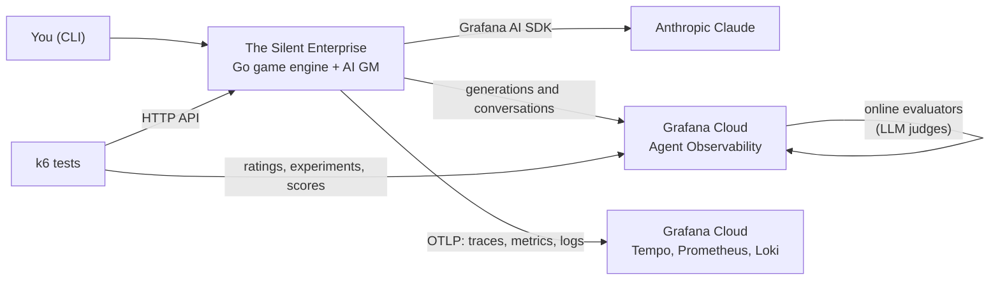

# Asimov's Zeroth Law of Robotics: Observability for AI

An AI app built to be observed and tested. **The Silent Enterprise** is a
single-player Star Trek text adventure: you play Data, and Claude is the game
master. It's instrumented with Grafana's Agent Observability and
OpenTelemetry, so every conversation, model call, dice roll, and turn shows up
in Grafana Cloud. A k6 test suite, some of it judged by Claude, checks whether
the AI follows the rules.

The game master has some known flaws, kept on purpose: it sometimes narrates
a rescue that didn't happen, or "destroys" a drone that's still standing. The
demo is about catching those flaws with telemetry, tests, and online
evaluators.

```text
================================================================
                     THE SILENT ENTERPRISE
           2014 5e subset with Star Trek adaptations
================================================================
Your positronic systems come online on the bridge of the
Enterprise. Every station is empty. Life support is stable, but
the computer reports no biological life signs aboard. A
diagnostic warning flashes at the operations console. Find the
crew and bring them home.
```

This is the companion repository for the talk "Asimov's Zeroth Law of
Robotics: Observability for AI" by Nicole van der Hoeven
([site](https://nicole.to/site), [Mastodon](https://pkm.social/@nicole),
[email](mailto:nicole@grafana.com)). See [Talks](#talks).

## Quickstart: play in 2 minutes, no accounts

You need either [Go](https://go.dev/dl/) 1.21 or newer (Go downloads the
1.26.3 toolchain this project needs automatically) or
[Docker](https://docs.docker.com/get-docker/). `make` comes with macOS and
Linux; on Windows, use Docker, WSL, or the commands in each target of the
[`Makefile`](Makefile).

```sh
git clone https://github.com/nicolevanderhoeven/asimov.git
cd asimov
make play-offline          # or: docker compose run --rm play --offline
```

Offline mode uses no API key, no LLM, and no network. Type `/actions` to see
what you can do, then try `/do inspect logs`. Type `/help` for every command
and `/quit` to leave.

Prefer not to install anything? Open the repository in
[GitHub Codespaces](https://docs.github.com/en/codespaces) or a VS Code
[Dev Container](https://code.visualstudio.com/docs/devcontainers/containers):
[`.devcontainer/`](.devcontainer/) sets up Go and k6 for you.

## Play with the AI game master

1. Create your settings file: `cp env.example .env`
2. Put an [Anthropic API key](https://console.anthropic.com/settings/keys) in
   `.env` as `ANTHROPIC_API_KEY`.
3. Run `make play-local`.

Now you can type anything ("I read the operations log", "I splice my
positronic net into the sensor buffer"), and the GM interprets it, rules on
it, and narrates. When a check needs a roll, make it with `/roll`. Each turn
makes about two Claude calls.

## Send telemetry to Grafana Cloud

This is the point of the demo. It takes about 15 minutes, and the
[setup guide](docs/grafana-cloud-setup.md) walks you through every value:

1. Create a free [Grafana Cloud](https://nicole.to/kceu2025grafana) stack and
   enable **Agent Observability**.
2. Create one Cloud Access Policy token, then copy it and four connection
   values into `.env`.
3. Run `make doctor`. It checks every setting without printing any secrets,
   and sends one test span, metric, log line, and generation, reporting
   whether Grafana Cloud accepted each one.
4. Run `make play`, play a few turns, and open **Agent Observability →
   Conversations** in Grafana. The guide lists where to find
   [everything else](docs/grafana-cloud-setup.md#6-play-and-find-your-data).

## Go further

| Next step | Guide |
| --- | --- |
| Test the AI with k6: code checks, LLM judges, dice-trajectory evals, and whole playthroughs. Results can be recorded as Agent Observability experiments. | [`tests/README.md`](tests/README.md) |
| Score live traffic all the time with Agent Observability online evaluators (LLM judges for each known flaw) | [`agento11y/README.md`](agento11y/README.md) |
| Route telemetry through a local OpenTelemetry Collector | [`collector/README.md`](collector/README.md) |
| How the game, its rules, its HTTP API, and its instrumentation work | [`go-game/README.md`](go-game/README.md) |

Run `make` on its own to list every shortcut:

```text
  play-offline     Play with no API key, LLM, or telemetry (exact /do commands only)
  play-local       Play with the AI GM but without sending telemetry (needs ANTHROPIC_API_KEY)
  play             Play with the AI GM, sending telemetry to Grafana Cloud
  serve            Run the HTTP API on :8080 for the k6 tests
  doctor           Check .env and send one test span, metric, log, and generation to Grafana Cloud
  test             Run the Go unit tests (no credentials needed)
  k6-graders       Trajectory graders against fixed cases: about 1s, no server or API calls
  k6-code          Fixed prompts with code checks: under 1 min, ~10 model calls
  k6-ai            Varied probes judged by Claude: 1-2 min, ~20 model calls
  k6-traffic       One minute of game traffic to populate Grafana: a few dozen model calls
  k6-trajectory    Dice trajectory evals: a few min, ~200 model calls
  k6-e2e           Five whole playthroughs: 5-10 min, a few hundred model calls
```

## How it fits together



The game engine owns the rules and the state. Claude only interprets the
player's input, decides whether a check needs a roll, makes the GM's own rolls
through a tool, and narrates. Telemetry is set up in
[`go-game/internal/telemetry`](go-game/internal/telemetry/telemetry.go). All
signals go straight to Grafana Cloud; a Collector is optional.

| Path | What's there |
| --- | --- |
| [`go-game/`](go-game/) | The game: CLI and HTTP API ([`cmd/enterprise`](go-game/cmd/enterprise)), the setup checker ([`cmd/doctor`](go-game/cmd/doctor)), rules engine, GM, and telemetry |
| [`tests/`](tests/) | The k6 test suite |
| [`agento11y/`](agento11y/) | Online evaluator and rule definitions |
| [`collector/`](collector/) | Optional OpenTelemetry Collector setup |
| [`docs/`](docs/) | The Grafana Cloud setup guide |
| [`scripts/`](scripts/) | The k6 runner the `make k6-*` targets use |

## Talks

- [KubeCon Europe 2025](https://nicolevanderhoeven.com/blog/20250402-asmiovs-zeroth-law-of-robotics/) in London, England ([video](https://www.youtube.com/watch?v=x6EKTCAWtn8))
- [Dutch Cloud Native Days 2025](https://nicolevanderhoeven.com/blog/20250703-asimovs-zeroth-law-dutch-cloud-native-day/) in Utrecht, the Netherlands
- [Newcrafts 2025](https://nicolevanderhoeven.com/blog/20251106-asimovs-zeroth-law-newcrafts/) in Paris, France ([slides](https://nicole.to/asimovslides))
- ExpoQA 2026 in Madrid, Spain ([slides](https://nicole.to/expoqa2026))

The earlier talks used a Python and Flask version of the app, which has since
been rewritten in Go. Its
[architecture slide](assets/Asimov's%20Zeroth%20Law%20of%20Robotics%20-%20ExpoQA%202026.jpg)
is kept for reference.

## Resources

- [Grafana Agent Observability SDK](https://github.com/grafana/agento11y) (formerly Sigil) for LLM generation telemetry, metrics, and traces on Grafana Cloud
- [Grafana AI SDK](https://github.com/grafana/ai-sdk) for the game's model calls and tools
- [OpenTelemetry](https://opentelemetry.io/) for instrumentation
- Free [Grafana Cloud](https://nicole.to/kceu2025grafana) for visibility
- [Loki](https://nicole.to/lokirepo) for logs
- [Prometheus](https://nicole.to/promrepo) for metrics
- [Tempo](https://nicole.to/temporepo) for traces
- [k6](https://nicole.to/k6repo) for testing

## References

Asimov, I. (1942). Runaround. In I, Robot (pp. 1-42). Gnome Press.

Pictures in presentation:
- https://animalia-life.club/qa/pictures/hal-9000-im-sorry-dave
- https://screenrant.com/star-trek-next-generation-data-make-no-sense-illogical/
- https://www.blogtorwho.com/smile-reactions/
- https://emsonthra.wordpress.com/2017/05/12/character-analysis-david-8/
- https://daleksrus.fandom.com/wiki/The_Daleks
- https://warnerbros.fandom.com/wiki/Rosey
- https://moviesandmania.com/2014/04/10/hell-is-other-robots-futurama-episode-animated-tv/
- https://www.reddit.com/r/SummerGlau/comments/gs9rlj/battle_damaged_terminator_used_unseen_outtake/
- https://theconversation.com/how-long-until-we-can-build-r2-d2-and-c-3po-52400
- https://www.flickr.com/photos/elferrada/2708912082
- https://memory-alpha.fandom.com/wiki/Locutus_of_Borg
- https://ita.animalia-life.club/vero-acciaio-tutti-i-personaggi-dei-robot

Quotes:
- https://grafana.com/blog/going-beyond-ai-chat-response-how-were-building-an-agentic-system-to-drive-grafana
- https://www.datadoghq.com/blog/engineering/bits-ai-eval-platform/#why-tool-level-testing-and-live-replay-werent-enough
- https://www.anthropic.com/engineering/demystifying-evals-for-ai-agents

## License

The code is licensed under the [Apache License 2.0](LICENSE). The game
includes material from the System Reference Document 5.1 under CC BY 4.0, and
it's an unofficial fan scenario; see
[Attribution](go-game/README.md#attribution). The images used in the talks
belong to their owners (see [References](#references)).
