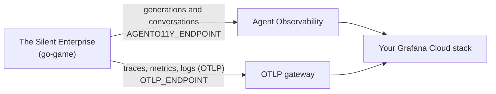

# Send the game's telemetry to Grafana Cloud

This guide takes you from no account to the game's conversations, traces,
metrics, and logs in Grafana Cloud. It takes about 15 minutes. The game
sends two kinds of data, and each has its own endpoint:



One Cloud Access Policy token covers both, but each endpoint has its own
instance ID. Mixing up the two instance IDs is the most common setup
mistake.

> **Names:** Agent Observability used to be called **Sigil**, and its API and
> SDK are named **agento11y**. All three names refer to the same product. The
> game still accepts the old `GRAFANA_CLOUD_SIGIL_ENDPOINT` variable name.

## 1. Create a stack and enable Agent Observability

1. Sign up for [Grafana Cloud](https://grafana.com/auth/sign-up/create-user)
   (the free tier is enough) or use an existing stack. You need the stack's
   admin role.
2. In your stack, go to **Observability → Agent Observability**, review and
   accept the terms, and click **Save**.

## 2. Copy the Agent Observability values

Go to **Agent Observability → Configuration** and copy two values into
`.env` (create it first with `cp env.example .env`):

| On the Configuration page | In `.env` |
| --- | --- |
| **API URL**, e.g. `https://sigil-prod-us-central-0.grafana.net` | `AGENTO11Y_ENDPOINT` |
| **Instance ID** | `GRAFANA_CLOUD_INSTANCE_ID` |

## 3. Create one token for everything

1. Open **Administration → Users and access → Cloud access policies**
   (`https://YOUR-STACK.grafana.net/a/grafana-auth-app`).
2. Click **Create access policy**. Name it something like `asimov`.
3. Under scopes, add **all four**: `sigil:write`, `metrics:write`,
   `logs:write`, and `traces:write`.
4. Click **Create**, then **Add token** on the new policy.
5. Copy the token, which starts with `glc_`, into `.env` as
   `GRAFANA_CLOUD_API_KEY`. **It's shown only once.** If you lose it, add a
   new token to the policy.

## 4. Copy the OTLP values

1. On [grafana.com](https://grafana.com), open **My Account**, choose your
   stack, and find the **OpenTelemetry** card. Click **Configure**.
2. Copy the **OTLP endpoint**, e.g.
   `https://otlp-gateway-prod-us-central-0.grafana.net/otlp`, into `.env` as
   `OTLP_ENDPOINT`.
3. Note the card's **Instance ID**. It can be a different number from the
   Agent Observability one.
4. Skip **Generate now**: your token from step 3 already has the OTLP
   scopes.
5. Combine the OTLP instance ID and your token into `OTLP_HEADERS`:

   ```sh
   printf '%s' 'OTLP_INSTANCE_ID:glc_YOUR_TOKEN' | base64
   ```

   Use `printf`, not `echo`, which adds a newline that breaks the header.
   Paste the output into `.env` as `OTLP_HEADERS`, without a `Basic ` prefix
   (the game adds it). On Linux, if the output wraps onto a second line, use
   `base64 -w0`.

   To keep the token out of your shell history, run the command with a
   space in front of it (in most shells), or type it into `.env` by hand.

## 5. Check it

```sh
make doctor
```

This runs [`go-game/cmd/doctor`](../go-game/cmd/doctor/main.go). It checks
every setting without printing any secrets, confirms that your Anthropic key
works (listing models is free), and sends one test span, metric, log line,
and generation. It reports whether Grafana Cloud accepted each one:

```text
Grafana Cloud delivery (sends one test item of each kind)
  ✔ trace accepted (Explore → Traces: service "asimov-enterprise-go", span "setup.check")
  ✔ metric accepted (Explore → Metrics: asimov_setup_check_total)
  ✔ log accepted (Explore → Logs: service_name="asimov-enterprise-go")
  ✔ generation accepted (Agent Observability → Conversations: "Setup check")
```

If you don't use `make`, run `cd go-game && go run ./cmd/doctor`. With
Docker, run `docker compose run --rm --entrypoint doctor play`.

## 6. Play and find your data

Run `make play` and play a few turns. Each turn makes two model calls, and
each one is a generation in a single conversation. Then look in Grafana; data
can take a minute or two to appear.

| What | Where |
| --- | --- |
| Conversations, generations, tool calls, token usage | **Agent Observability → Conversations**. Each game is one conversation, titled "The Silent Enterprise". |
| Per-agent-version performance and evaluator scores | The `asimov-enterprise-go` agent's **Performance** view in Agent Observability |
| Traces: a `game.turn` span per turn, with model calls and `game.gm_roll` spans under it | **Drilldown → Traces**, filtered to service `asimov-enterprise-go` |
| Game metrics | **Drilldown → Metrics** or Explore: `game_actions_total`, `game_improvisations_total` |
| Model metrics from the SDK | `gen_ai_client_operation_duration_seconds`, `gen_ai_client_token_usage`, `gen_ai_client_time_to_first_token_seconds`, `gen_ai_client_tool_calls_per_operation_count` |
| Structured logs | **Drilldown → Logs**: `{service_name="asimov-enterprise-go"}` |

## Troubleshooting

| Symptom | Likely cause |
| --- | --- |
| `401 Unauthorized ... invalid token` | Wrong token, or the wrong instance ID for that endpoint. The OTLP instance ID goes inside `OTLP_HEADERS`; the Agent Observability one goes in `GRAFANA_CLOUD_INSTANCE_ID`. |
| `403 Forbidden` | The token is missing a scope. Edit the access policy and add the missing one. |
| `OTLP_HEADERS isn't base64` | Paste only the output of the `printf ... \| base64` command, not the raw `id:token`. |
| `no such host` | A typo in the endpoint, or the `REGION` placeholder from `env.example` is still there. |
| Conversations appear, but Agent Observability's analytics panels stay empty | The analytics come from your stack's Prometheus and Tempo. Check that metrics and traces are arriving (step 5), and that Agent Observability's Configuration page uses your stack's `grafanacloud-<stack>-prom` and `grafanacloud-<stack>-traces` data sources. |
| The game exits with `missing OTLP_ENDPOINT ...` | Telemetry is on by default. Fill in `.env`, or play with `make play-local` (`--no-telemetry`). |

## Keep your keys safe

- `.env` is git-ignored. Keep every real value there and nowhere else, and
  never paste a token into `env.example`, a config file, or a commit.
- If a token is ever committed, even briefly, **revoke it right away** in
  Cloud access policies and create a new one. Removing the commit isn't
  enough once it has been pushed.
- The optional [Collector config](../collector/README.md) reads its
  credentials from `.env` too; `collector/otel-config.yml` is git-ignored.
- Player inputs and the GM's narration are sent to Agent Observability as
  content. Don't type secrets into the game.
